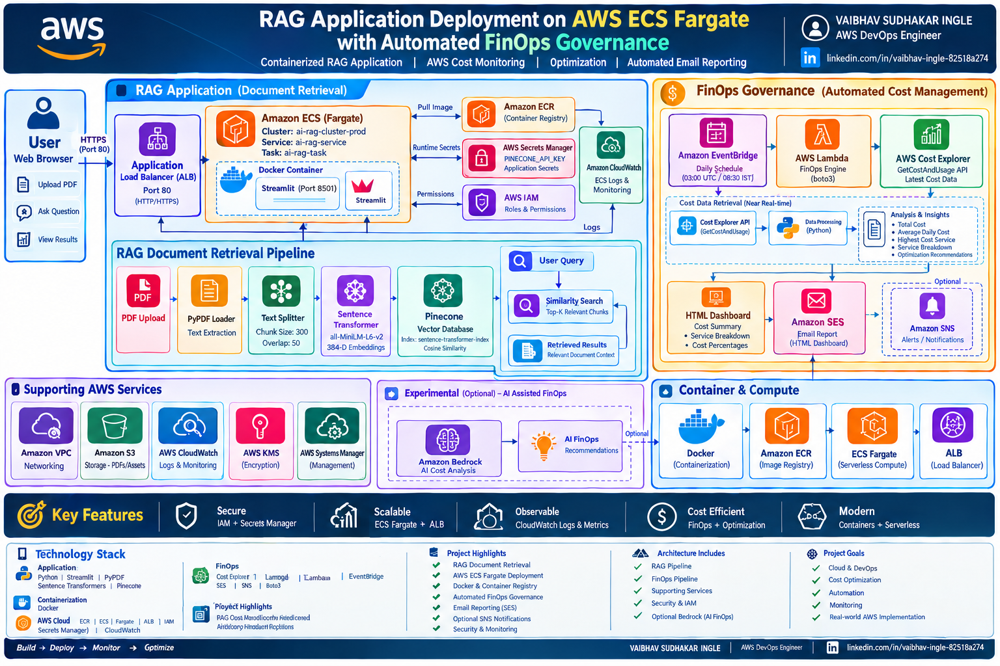

# 🚀 RAG Application Deployment on AWS ECS Fargate with Automated FinOps Governance

<p align="center">


<br>


</p>

---

## 📌 Project Overview

This project demonstrates the deployment of a **containerized RAG (Retrieval-Augmented Generation) document retrieval application** on **AWS ECS Fargate**, combined with an automated **AWS FinOps monitoring and cost governance system**.

The RAG application allows users to upload PDF documents and retrieve relevant information using:

- Python
- Streamlit
- PyPDF
- Custom text chunking
- Hugging Face Sentence Transformers
- Pinecone Vector Database
- Docker

The AWS deployment uses:

- Amazon ECR
- Amazon ECS Fargate
- Application Load Balancer
- AWS IAM
- AWS Secrets Manager
- Amazon CloudWatch

A separate FinOps automation pipeline monitors AWS spending using:

- AWS Cost Explorer
- AWS Lambda
- Amazon EventBridge
- Python / Boto3
- Amazon SES
- Amazon SNS
- CloudWatch

The project combines **Cloud, DevOps, RAG, Serverless Automation, and FinOps** into a practical AWS solution.

---

# 🏗️ Complete Project Architecture

<p align="center">
  
</p>

---

---

# 🏗️ Overall Architecture

```text
                         ┌────────────────────────────┐
                         │          User              │
                         │       Web Browser          │
                         └──────────────┬─────────────┘
                                        │
                                        ▼
                         ┌────────────────────────────┐
                         │ Application Load Balancer  │
                         │          HTTP :80          │
                         └──────────────┬─────────────┘
                                        │
                                        ▼
                         ┌────────────────────────────┐
                         │      Amazon ECS Fargate     │
                         │                            │
                         │     RAG Application        │
                         │     Docker Container       │
                         └──────────────┬─────────────┘
                                        │
                         ┌──────────────┴──────────────┐
                         │                             │
                         ▼                             ▼
                ┌─────────────────┐          ┌──────────────────┐
                │   PyPDF Loader  │          │ Sentence         │
                │   PDF Parsing   │          │ Transformer      │
                └────────┬────────┘          │ Embeddings       │
                         │                   └────────┬─────────┘
                         ▼                            │
                ┌─────────────────┐                   │
                │ Text Chunking   │───────────────────┘
                └────────┬────────┘
                         │
                         ▼
                ┌────────────────────┐
                │ Pinecone Vector DB │
                │ Semantic Retrieval │
                └─────────┬──────────┘
                          │
                          ▼
                  Retrieved Results
                          │
                          ▼
                         User
````

---

# 💰 FinOps Architecture

```text
                 ┌────────────────────────┐
                 │   Amazon EventBridge    │
                 │    Daily Schedule      │
                 └────────────┬───────────┘
                              │
                              ▼
                 ┌────────────────────────┐
                 │      AWS Lambda        │
                 │   FinOps Cost Engine   │
                 └────────────┬───────────┘
                              │
                 ┌────────────┴────────────┐
                 │                         │
                 ▼                         ▼
        ┌──────────────────┐      ┌──────────────────┐
        │ AWS Cost Explorer│      │ Python / Boto3   │
        │  Cost Data       │─────▶│ Cost Analysis    │
        └──────────────────┘      └────────┬─────────┘
                                           │
                                           ▼
                                  ┌──────────────────┐
                                  │ FinOps Analysis  │
                                  │ & Recommendations│
                                  └────────┬─────────┘
                                           │
                                           ▼
                                  ┌──────────────────┐
                                  │  HTML Dashboard  │
                                  │   Cost Report    │
                                  └────────┬─────────┘
                                           │
                                           ▼
                                  ┌──────────────────┐
                                  │   Amazon SES     │
                                  │  Email Delivery  │
                                  └──────────────────┘
```

---

# 🔄 RAG Application Flow

```text
PDF Upload
    ↓
PyPDF
    ↓
Text Extraction
    ↓
Text Chunking
    ↓
Sentence Transformer
    ↓
Vector Embeddings
    ↓
Pinecone
    ↓
Similarity Search
    ↓
Top Relevant Chunks
    ↓
Streamlit UI
    ↓
User
```

The current application focuses on **document retrieval**. It retrieves and displays the most relevant document chunks using vector similarity search.

---

# 🔄 FinOps Automation Flow

```text
EventBridge
     ↓
Lambda
     ↓
AWS Cost Explorer
     ↓
Cost Data
     ↓
Python / Boto3
     ↓
Cost Analysis
     ↓
Optimization Recommendations
     ↓
HTML Dashboard
     ↓
Amazon SES
     ↓
Automated Email Report
```

---

# 🧠 RAG Components

## 📄 PDF Loader

`loader.py`

Uses `pypdf` to extract text from uploaded PDF documents.

---

## ✂️ Text Splitter

`Splitters.py`

Splits extracted document text into smaller chunks for efficient embedding and similarity search.

Current configuration:

```text
Chunk Size : 300 characters
Overlap    : 50 characters
```

---

## 🤗 Embedding Model

`model.py`

Uses the Sentence Transformer model:

```text
all-MiniLM-L6-v2
```

The model converts document chunks and user queries into numerical vector embeddings.

---

## 🌲 Vector Database

`Vectors.py`

Uses **Pinecone** for vector storage and similarity search.

The application:

* Creates document embeddings
* Stores vectors in Pinecone
* Performs similarity search
* Retrieves relevant document chunks

Pinecone index:

```text
sentence-transformer-index
```

Embedding dimension:

```text
384
```

Similarity metric:

```text
Cosine
```

---

## 🎨 Streamlit Application

`app.py`

Provides the web interface for:

* PDF upload
* Document processing
* Chunk creation
* Embedding generation
* Pinecone indexing
* User questions
* Similarity search
* Retrieved result visualization

Application port:

```text
8501
```

---

# 🐳 Containerization

The application is containerized using Docker.

### Base Image

```text
Python 3.11 Slim
```

### Container Port

```text
8501
```

### Application

```text
Streamlit
```

Docker provides a consistent runtime environment for local development and AWS deployment.

---

# ☁️ AWS Deployment Architecture

```text
Developer
    ↓
GitHub
    ↓
Docker Build
    ↓
Amazon ECR
    ↓
ECS Task Definition
    ↓
ECS Fargate
    ↓
Application Load Balancer
    ↓
RAG Application
```

---

# 📦 Amazon ECR

Amazon ECR is used as the private container registry.

Example repository:

```text
ai-rag-gateway-prod
```

Container workflow:

```text
Docker Build
     ↓
Docker Tag
     ↓
Push Image to ECR
     ↓
ECS Fargate Pulls Image
```

---

# 🚀 Amazon ECS Fargate

The RAG application runs as a serverless container workload using Amazon ECS Fargate.

Example configuration:

```text
Cluster:
ai-rag-cluster-prod

Service:
ai-rag-service

Task Definition:
ai-rag-task

Container:
rag-container

Container Port:
8501
```

Fargate allows the application to run without managing EC2 instances for the application workload.

---

# 🌐 Application Load Balancer

An Application Load Balancer provides external access to the ECS application.

```text
Internet
    ↓
ALB :80
    ↓
Target Group
    ↓
ECS Fargate
    ↓
Container :8501
```

Health check path:

```text
/
```

Target type:

```text
IP
```

---

# 🔐 Secrets Management

Application secrets are not hardcoded inside the Docker image.

The project uses:

```text
AWS Secrets Manager
```

Example application secrets:

```text
PINECONE_API_KEY
GROQ_API_KEY
```

ECS injects required secrets into the container at runtime.

---

# 📊 Monitoring

Amazon CloudWatch is used for application and infrastructure monitoring.

CloudWatch provides:

* ECS container logs
* Lambda execution logs
* Error visibility
* Application troubleshooting
* FinOps Lambda monitoring

Example ECS log group:

```text
/aws/ecs/ai-rag-gateway-prod
```

---

# 💰 FinOps Automation

The project includes an independent AWS FinOps automation pipeline.

The system uses **AWS Cost Explorer** to retrieve the latest available AWS cost data and performs service-level cost analysis.

The system calculates:

* Total AWS cost
* Daily AWS cost
* Average daily cost
* Service-wise cost
* Highest-cost service
* Cost contribution percentage
* Top-cost services

The focus is on **cost visibility, cost analysis, and automated cost reporting**.

---

# 📧 Automated Email Reporting

The final FinOps implementation uses **Amazon SES**.

The Lambda function generates an HTML-based cost dashboard containing:

* AWS cost summary
* Total cost for the reporting period
* Average daily cost
* Highest-cost AWS service
* Service-wise cost breakdown
* Cost percentage by service
* Top-cost services
* FinOps optimization recommendations
* HTML visualization of major cost contributors

The report is automatically delivered through email.

---

# 🔔 SNS Notification Implementation

An alternative SNS-based implementation is also included.

The SNS implementation:

* Retrieves AWS cost information
* Calculates service-level costs
* Identifies the highest-cost service
* Generates a text-based report
* Publishes the report to an SNS topic

SNS provides an alternative notification mechanism for the FinOps pipeline.

---

# 🤖 Bedrock FinOps Experiment

A separate Amazon Bedrock implementation was developed to explore **AI-assisted AWS cost analysis**.

Architecture:

```text
AWS Cost Explorer
       ↓
Lambda
       ↓
Cost Summary
       ↓
Amazon Bedrock
       ↓
AI FinOps Recommendations
```

The experimental implementation was designed to analyze AWS cost data and provide recommendations such as:

* Highest-cost services
* Potential optimization opportunities
* Services requiring review
* General FinOps recommendations

The implementation is maintained separately under:

```text
bedrock/
```

---

# ⏰ EventBridge Automation

Amazon EventBridge is used to schedule the FinOps Lambda.

Example schedule:

```text
cron(0 3 * * ? *)
```

Schedule:

```text
03:00 UTC
08:30 IST
```

The automated process runs daily and generates the latest available cost report.

---

# 📈 FinOps Recommendations

The project provides basic rule-based recommendations based on AWS spending patterns.

Examples include:

* Review high-cost AWS services
* Check unused resources
* Review ECS/Fargate resource allocation
* Review EC2 instance sizing
* Monitor storage and networking costs
* Investigate unexpected service-level cost increases
* Consider scheduling non-production workloads
* Review opportunities for resource optimization

---

# 🔐 Security

Security practices implemented in the project include:

* IAM roles instead of hardcoded AWS credentials
* AWS Secrets Manager for application secrets
* Environment-based configuration
* Private ECR repository
* IAM permission-based access
* CloudWatch monitoring
* `.env` excluded through `.gitignore`
* Sensitive API keys are not committed to GitHub

---

# 📁 Project Structure

```text
RAG-Application-AWS-ECS-Fargate-FinOps/
│
├── app.py
├── loader.py
├── Splitters.py
├── model.py
├── Vectors.py
├── Dockerfile
├── requirements.txt
├── .gitignore
│
├── finops/
│   ├── finops_cost_report_ses.py
│   ├── finops_cost_report_sns.py
│   └── README.md
│
├── bedrock/
│   ├── finops_bedrock.py
│   └── README.md
│
├── docs/
│   └── architecture.png
│
└── README.md
```

---

# 🐍 Python Components

| File                        | Purpose                                  |
| --------------------------- | ---------------------------------------- |
| `app.py`                    | Streamlit RAG application                |
| `loader.py`                 | PDF text extraction                      |
| `Splitters.py`              | Document text chunking                   |
| `model.py`                  | Sentence Transformer embeddings          |
| `Vectors.py`                | Pinecone vector storage and search       |
| `finops_cost_report_ses.py` | Production FinOps email dashboard        |
| `finops_cost_report_sns.py` | SNS-based FinOps notification            |
| `finops_bedrock.py`         | Experimental AI-assisted FinOps analysis |

---

# ☁️ AWS Services Used

| AWS Service               | Purpose                                  |
| ------------------------- | ---------------------------------------- |
| Amazon ECS Fargate        | Runs the RAG container                   |
| Amazon ECR                | Stores Docker images                     |
| Application Load Balancer | Provides application access              |
| AWS IAM                   | Identity and permissions                 |
| AWS Secrets Manager       | Secure application secrets               |
| Amazon CloudWatch         | Logs and monitoring                      |
| AWS Lambda                | FinOps automation                        |
| Amazon EventBridge        | Scheduled execution                      |
| AWS Cost Explorer         | AWS cost data                            |
| Amazon SES                | Automated email reporting                |
| Amazon SNS                | Alternative notifications                |
| Amazon Bedrock            | Experimental AI-assisted FinOps analysis |

---

# 🛠️ Technology Stack

## Application

```text
Python
Streamlit
PyPDF
Sentence Transformers
Pinecone
```

## Containerization

```text
Docker
```

## AWS Cloud

```text
Amazon ECR
Amazon ECS
AWS Fargate
Application Load Balancer
IAM
Secrets Manager
CloudWatch
```

## FinOps

```text
AWS Cost Explorer
AWS Lambda
Amazon EventBridge
Amazon SES
Amazon SNS
Python
Boto3
```

---

# 🎯 Project Objectives

This project demonstrates practical experience in:

* Containerized application deployment
* Docker image management
* Amazon ECS Fargate
* Application Load Balancing
* Secure secret management
* Serverless automation
* AWS cost monitoring
* FinOps principles
* Automated cloud reporting
* Python / Boto3 automation
* CloudWatch monitoring
* RAG document retrieval
* Vector database integration

---

# 🏆 Project Highlights

| Area                      | Implementation |
| ------------------------- | -------------- |
| AWS Cloud                 | ✅              |
| DevOps                    | ✅              |
| Docker                    | ✅              |
| ECS Fargate               | ✅              |
| Amazon ECR                | ✅              |
| RAG                       | ✅              |
| Pinecone Vector Database  | ✅              |
| FinOps                    | ✅              |
| Serverless Automation     | ✅              |
| Cloud Monitoring          | ✅              |
| Cost Optimization         | ✅              |
| Automated Reporting       | ✅              |
| Email Notifications       | ✅              |
| Infrastructure Security   | ✅              |
| Python / Boto3 Automation | ✅              |

---

# 🎯 Project Outcome

This project demonstrates an end-to-end AWS solution combining a **containerized RAG document retrieval application** with an independent **FinOps automation pipeline**.

### RAG Pipeline

```text
PDF
 ↓
Text Extraction
 ↓
Chunking
 ↓
Embeddings
 ↓
Pinecone
 ↓
Similarity Search
 ↓
Retrieved Results
```

### AWS Deployment Pipeline

```text
Docker
 ↓
Amazon ECR
 ↓
Amazon ECS Fargate
 ↓
Application Load Balancer
 ↓
Streamlit Application
```

### FinOps Pipeline

```text
EventBridge
 ↓
Lambda
 ↓
AWS Cost Explorer
 ↓
Python Analysis
 ↓
FinOps Recommendations
 ↓
HTML Dashboard
 ↓
Amazon SES
 ↓
Email Report
```

---

# 🚀 Future Enhancements

* Add an LLM generation layer for complete natural-language RAG responses
* Improve document-specific vector namespaces
* Add document metadata management
* Add AWS Cost Anomaly Detection
* Add AWS Budgets integration
* Add cost threshold alerts
* Add ECS Fargate rightsizing analysis
* Add automated resource optimization
* Add multi-account FinOps reporting
* Add historical cost dashboards
* Add Amazon QuickSight visualization
* Expand AI-assisted cost recommendations

---

# 👨‍💻 Author

<div align="center">


### 🚀 AWS DevOps Engineer | Cloud & DevOps Enthusiast | FinOps

<br>


<br><br>


<br><br>

## 🛠️ Skills Demonstrated

`AWS` `Docker` `Kubernetes` `ECS` `Fargate` `ECR` `Lambda`
`EventBridge` `Cost Explorer` `SES` `SNS` `CloudWatch`
`IAM` `Secrets Manager` `Python` `Boto3` `FinOps` `RAG`

<br>

## 🔗 Connect With Me

<a href="https://github.com/vaibhavingle2002">

</a>

<a href="https://www.linkedin.com/in/vaibhav-ingle-82518a274/">

</a>

<a href="mailto:devopsguyvaibhav888@gmail.com">

</a>

<br><br>

---

### ☁️ AWS DevOps • 🚀 Automation • 💰 FinOps • 🐳 Containers • 📊 Cloud Monitoring

### **Build → Deploy → Monitor → Optimize**

<br>


<br><br>

**Built with ❤️ by Vaibhav Ingle**

⭐ If you found this project useful, consider giving it a star!

</div>

---
